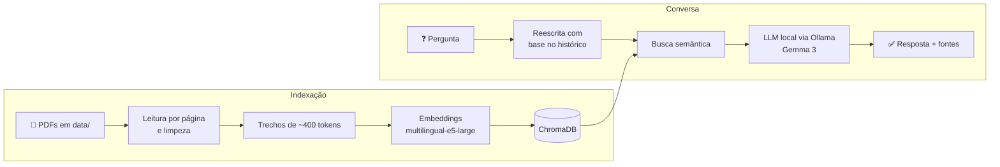

<div align="center">

# 🔐 Assistente Jurídico ICP-Brasil

**Converse com os documentos normativos da ICP-Brasil usando IA 100% local.**

Perguntas em linguagem natural, respostas fundamentadas nos DOC-ICP e citação de documento e página. Nada sai da sua máquina.

[](https://www.python.org/)
[](https://streamlit.io/)
[](https://www.llamaindex.ai/)
[](https://ollama.com/)
[](https://www.trychroma.com/)
[](LICENSE)

[Funcionalidades](#-funcionalidades) •
[Instalação](#-instalação) •
[Uso](#-uso) •
[Configuração](#%EF%B8%8F-configuração) •
[Problemas comuns](#-problemas-comuns)

</div>

---

## ✨ Funcionalidades

| | |
| --- | --- |
| 💬 **Chat moderno** | Interface web com respostas em tempo real (streaming) e sugestões de perguntas |
| 📄 **Fontes verificáveis** | Toda resposta mostra os trechos usados, com documento, página e similaridade |
| 🧠 **Memória de conversa** | Entende perguntas de acompanhamento, como *"e para o tipo A3?"* |
| ⚡ **Indexação incremental** | Reprocessa apenas PDFs novos, alterados ou removidos, e retoma se for interrompida |
| 🎛️ **Ajustes ao vivo** | Troque o modelo, a temperatura e o número de trechos direto na interface |
| 📥 **Exportação** | Salve a conversa em Markdown com as fontes |
| 🔒 **Privacidade total** | LLM, embeddings e banco vetorial rodam localmente, sem APIs externas |
| 🖥️ **Modo terminal** | Prefere a linha de comando? `python main.py` |

## 🧭 Como funciona



1. **Indexação:** os PDFs são lidos página a página e divididos em trechos. Cada trecho vira um vetor (embedding) armazenado no ChromaDB. Um manifesto guarda o hash de cada arquivo para detectar mudanças.
2. **Busca:** a pergunta (já reescrita com o contexto da conversa) é comparada com os trechos, e os mais relevantes são recuperados.
3. **Resposta:** o LLM recebe os trechos com instruções para responder **somente** com base neles e citar as fontes no formato `[DOC-ICP-XX, p. N]`.

## 💻 Requisitos

| Recurso | Mínimo | Recomendado |
| --- | --- | --- |
| Python | 3.10 | 3.12 |
| Memória RAM | 8 GB (com `gemma3:4b`) | 16 GB ou mais (com `gemma3:12b`) |
| Disco livre | ~6 GB | ~12 GB |
| GPU | Opcional | NVIDIA com 8 GB+ de VRAM, ou Apple Silicon |

> [!NOTE]
> O espaço em disco inclui o modelo de LLM (~3 GB para `gemma3:4b` ou ~8 GB para `gemma3:12b`) e o modelo de embeddings (~2 GB), baixados uma única vez.

## 🚀 Instalação

### 1. Instale o Python

<details>
<summary><b>Windows</b></summary>

```powershell
winget install Python.Python.3.12
```

Ou baixe em [python.org/downloads](https://www.python.org/downloads/). No instalador, marque **"Add python.exe to PATH"**.
</details>

<details>
<summary><b>macOS</b></summary>

```bash
brew install python@3.12
```
</details>

<details>
<summary><b>Linux (Debian/Ubuntu)</b></summary>

```bash
sudo apt update && sudo apt install python3 python3-venv python3-pip
```
</details>

Confira com `python --version` (ou `python3 --version`).

### 2. Instale o Ollama e baixe o modelo

<details open>
<summary><b>Windows</b></summary>

```powershell
winget install Ollama.Ollama
```

Ou baixe o instalador em [ollama.com/download](https://ollama.com/download). Depois de instalado, o Ollama roda em segundo plano (ícone na bandeja do sistema).
</details>

<details>
<summary><b>macOS</b></summary>

```bash
brew install ollama
```

Ou baixe o app em [ollama.com/download](https://ollama.com/download).
</details>

<details>
<summary><b>Linux</b></summary>

```bash
curl -fsSL https://ollama.com/install.sh | sh
```
</details>

Em seguida, baixe o modelo de linguagem:

```bash
ollama pull gemma3:12b   # recomendado (16 GB+ de RAM)
# ou
ollama pull gemma3:4b    # mais leve (8 GB de RAM)
```

> [!TIP]
> Teste se está tudo certo com `ollama run gemma3:12b "Olá!"`. Se responder, o Ollama está pronto.

### 3. Clone o projeto

```bash
git clone https://github.com/bryan-assuncao/chatbot-local-icpbrasil.git
cd chatbot-local-icpbrasil
```

### 4. Crie o ambiente virtual e instale as dependências

<details open>
<summary><b>Com pip (padrão)</b></summary>

**Windows (PowerShell):**

```powershell
python -m venv .venv
.venv\Scripts\Activate.ps1
pip install -r requirements.txt
```

**macOS / Linux:**

```bash
python3 -m venv .venv
source .venv/bin/activate
pip install -r requirements.txt
```
</details>

<details>
<summary><b>Com uv (mais rápido)</b></summary>

Com o [uv](https://docs.astral.sh/uv/) instalado:

```bash
uv venv
uv pip install -r requirements.txt
```

Ative o ambiente da mesma forma (`.venv\Scripts\Activate.ps1` no Windows, `source .venv/bin/activate` no macOS/Linux).
</details>

> [!IMPORTANT]
> **Tem GPU NVIDIA?** Instale o PyTorch com suporte a CUDA para indexar os documentos muito mais rápido:
> ```bash
> pip install torch --index-url https://download.pytorch.org/whl/cu126
> ```
> Veja a combinação certa para o seu sistema em [pytorch.org](https://pytorch.org/get-started/locally/).

## 🎯 Uso

### Interface web

```bash
streamlit run app.py
```

O navegador abre automaticamente em **http://localhost:8501**. Depois:

1. Na barra lateral, clique em **🔄 Atualizar índice**. Isso só é necessário na primeira vez ou quando os PDFs mudarem.
2. Faça sua pergunta ou clique em uma das sugestões.
3. Abra **📄 Fontes consultadas** abaixo da resposta para conferir os trechos originais.

> [!NOTE]
> A primeira indexação baixa o modelo de embeddings (~2 GB) e processa todos os PDFs. Na CPU, pode levar de alguns minutos a mais de uma hora, dependendo da máquina. As próximas execuções abrem instantaneamente.

### Terminal

```bash
python main.py
```

O índice é sincronizado automaticamente ao iniciar.

| Comando | Ação |
| --- | --- |
| `limpar` | Inicia uma nova conversa |
| `sair` | Encerra o programa |
| `Ctrl+C` | Interrompe a resposta em andamento |

### Gerenciando os documentos

Os PDFs ficam na pasta [`data/`](data/), e subpastas também são lidas. Para **adicionar, atualizar ou remover** documentos, basta alterar os arquivos e clicar em **Atualizar índice**. Apenas o que mudou é reprocessado.

## ⚙️ Configuração

Todas as opções têm valores padrão e funcionam sem configurar nada. Para personalizar, copie o arquivo de exemplo:

```bash
cp .env.example .env      # Windows: copy .env.example .env
```

| Variável | Padrão | Descrição |
| --- | --- | --- |
| `OLLAMA_URL` | `http://localhost:11434` | Endereço do servidor Ollama |
| `ICP_LLM_MODEL` | `gemma3:12b` | Modelo padrão do Ollama |
| `ICP_TEMPERATURE` | `0.0` | Criatividade do modelo (0 = mais fiel aos documentos) |
| `ICP_REQUEST_TIMEOUT` | `300` | Tempo limite (segundos) para o LLM responder |
| `ICP_CONTEXT_WINDOW` | `8192` | Janela de contexto do modelo, em tokens |
| `ICP_DATA_DIR` | `data` | Pasta com os PDFs |
| `ICP_PERSIST_DIR` | `chroma_db` | Pasta onde o índice é salvo |
| `ICP_EMBED_MODEL` | `intfloat/multilingual-e5-large` | Modelo de embeddings (HuggingFace) |
| `ICP_CHUNK_SIZE` | `400` | Tamanho de cada trecho, em tokens |
| `ICP_CHUNK_OVERLAP` | `60` | Sobreposição entre trechos, em tokens |
| `ICP_TOP_K` | `8` | Trechos recuperados por pergunta |

> [!WARNING]
> Alterar `ICP_EMBED_MODEL`, `ICP_CHUNK_SIZE` ou `ICP_CHUNK_OVERLAP` invalida o índice. A aplicação detecta isso e pede uma reindexação completa.

**Outros modelos:** qualquer modelo do [catálogo do Ollama](https://ollama.com/library) pode ser usado, por exemplo `qwen3`, `llama3.1` ou `mistral`. Baixe com `ollama pull <modelo>` e selecione na barra lateral.

## 🩺 Problemas comuns

<details>
<summary><b>"Ollama não está acessível"</b></summary>

O servidor do Ollama não está rodando. Abra o aplicativo do Ollama ou execute `ollama serve` em outro terminal. Se ele estiver em outra máquina ou porta, ajuste `OLLAMA_URL` no `.env`.
</details>

<details>
<summary><b>"Modelo não baixado" ou erro de modelo não encontrado</b></summary>

Execute `ollama pull <nome-do-modelo>` e confira os modelos instalados com `ollama list`.
</details>

<details>
<summary><b>A primeira resposta demora muito ou dá timeout</b></summary>

Na primeira pergunta, o Ollama carrega o modelo na memória, o que pode levar mais de um minuto. Se der timeout, aumente `ICP_REQUEST_TIMEOUT` no `.env` ou use um modelo menor (`gemma3:4b`).
</details>

<details>
<summary><b>Falta de memória ou computador travando</b></summary>

Use um modelo menor (`gemma3:4b`) e/ou reduza `ICP_CONTEXT_WINDOW` para `4096`. Feche outros programas pesados durante o uso.
</details>

<details>
<summary><b>A indexação está muito lenta</b></summary>

Os embeddings são calculados na CPU por padrão. Com GPU NVIDIA, instale o PyTorch com CUDA (veja a [instalação](#4-crie-o-ambiente-virtual-e-instale-as-dependências)). A indexação é feita só uma vez e pode ser interrompida e retomada depois.
</details>

<details>
<summary><b>PowerShell: "a execução de scripts foi desabilitada neste sistema"</b></summary>

Libere a execução de scripts para o seu usuário e ative o ambiente novamente:

```powershell
Set-ExecutionPolicy -Scope CurrentUser RemoteSigned
```
</details>

<details>
<summary><b>Quero recriar o índice do zero</b></summary>

Apague a pasta `chroma_db/` e clique em **Atualizar índice** (ou rode `python main.py`).
</details>

## 🗂️ Estrutura do projeto

```
chatbot-local-icpbrasil/
├── app.py               # Interface web (Streamlit)
├── main.py              # Modo terminal
├── icp_chat/
│   ├── config.py        # Configurações (variáveis de ambiente / .env)
│   ├── prompts.py       # Prompts do assistente
│   └── rag.py           # Indexação incremental e motor de conversa
├── data/                # PDFs da ICP-Brasil (DOC-ICP)
├── .streamlit/          # Tema da interface
├── .env.example         # Modelo de configuração
└── requirements.txt
```

## ⚠️ Aviso

Este assistente é uma ferramenta de apoio à consulta e **não substitui orientação jurídica profissional**. As respostas podem conter imprecisões. Sempre confira as fontes citadas e a versão vigente dos documentos no [site do ITI](https://www.gov.br/iti/pt-br).

## 📄 Licença

Distribuído sob a licença MIT. Veja [LICENSE](LICENSE).
